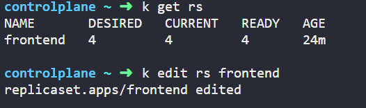

# Solution

### Task 1 (Use Kodekloud Free Public Labs)

- Create a new Replicaset based on the nginx image with 3 replicas

First step is to got the link https://kubernetes.io/docs/concepts/workloads/controllers/replicaset/

Copy the replicaset example from the template


Make the nessary changes, I updated the file in the lab just change the image name and labels and pasted the manifest file.

```
apiVersion: apps/v1
kind: ReplicaSet
metadata:
  name: frontend
  labels:
    app: "taskday8"
    tier: frontend
spec:
  # modify replicas according to your case
  replicas: 3
  selector:
    matchLabels:
      tier: frontend
  template:
    metadata:
      labels:
        tier: frontend
    spec:
      containers:
      - name: nginx
        image: nginx
```

Got some errors while running the ``` k apply -f nginx.yaml```

There was a proble becuase of the spaces, "Task Day 8" under the labels.

Kubernetes labels must follow this rule:
- Only: A–Z a–z 0–9 - _ .
- No spaces
- Must start and end with an alphanumeric character

**Fix this with "task-day-8" OR TaskDay8"**

<mark> Learning: ReplicaSet names can be more flexible, but labels are strict because Kubernetes uses them internally for selectors, scheduling, and querying.</mark>

Check the RS by ```k descrive rs frontend```


---

### Task 1.2 (Use Kodekloud Free Public Labs)

- Update the replicas to 4 from the YAML

vi nginx.yaml

Change the number of replicas to 4 and save the file.

Once done, run the command ``` k apply -f nginx.yaml```

---


### Task 1.3 (Use Kodekloud Free Public Labs)

- Update the replicas to 6 from the command line

To change the current replicas use the command as follow ``` k edit rs frontend```



