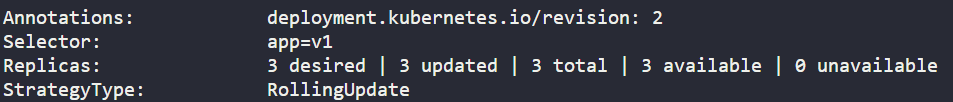
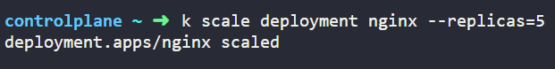
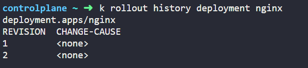

### Task 2.1 (Use Kodekloud Free Public Labs)

Run the command ```k create deployment nginx --image nginx:1.23.0 --replicas=3 --dry-run=client -o yaml```

```
apiVersion: apps/v1
kind: Deployment
metadata:
  labels:
    app: nginx
  name: nginx
spec:
  replicas: 3
  selector:
    matchLabels:
      app: nginx
  strategy: {}
  template:
    metadata:
      labels:
        app: nginx
    spec:
      containers:
      - image: nginx:1.23.0
        name: nginx
        resources: {}
status: {}
```
Now save it an yaml by > deploy.yaml

```
apiVersion: apps/v1
kind: Deployment
metadata:
  labels:
    tier: backend
    app: nginx
  name: nginx
spec:
  replicas: 3
  selector:
    matchLabels:
      app: v1
  strategy: {}
  template:
    metadata:
      labels:
        app: v1
    spec:
      containers:
      - image: nginx:1.23.0
        name: nginx
        resources: {}
status: {}

```
<mark>Make the changes in the labels field as requested and match the template label to the replicaset labels.</mark>

---

```
controlplane ~ ➜  k apply -f deployment.yaml 
deployment.apps/nginx created

controlplane ~ ➜  k describe deployments.apps 
Name:                   nginx
Namespace:              default
CreationTimestamp:      Thu, 22 Jan 2026 11:21:54 +0000
Labels:                 app=nginx
                        tier=backend
Annotations:            deployment.kubernetes.io/revision: 1
Selector:               app=v1
Replicas:               3 desired | 3 updated | 3 total | 3 available | 0 unavailable
StrategyType:           RollingUpdate
MinReadySeconds:        0
RollingUpdateStrategy:  25% max unavailable, 25% max surge
Pod Template:
  Labels:  app=v1
  Containers:
   nginx:
    Image:         nginx:1.23.0
    Port:          <none>
    Host Port:     <none>
    Environment:   <none>
    Mounts:        <none>
  Volumes:         <none>
  Node-Selectors:  <none>
  Tolerations:     <none>
Conditions:
  Type           Status  Reason
  ----           ------  ------
  Available      True    MinimumReplicasAvailable
  Progressing    True    NewReplicaSetAvailable
OldReplicaSets:  <none>
NewReplicaSet:   nginx-7c9d486897 (3/3 replicas created)
Events:
  Type    Reason             Age   From                   Message
  ----    ------             ----  ----                   -------
  Normal  ScalingReplicaSet  12s   deployment-controller  Scaled up replica set nginx-7c9d486897 from 0 to 3
```

Subpoints:
- List the Deployment and ensure the correct number of replicas is running.


- Update the image to nginx:1.23.4.
Use the ```k edit deployment```


Verify by the command ``` k describe deployment nginx | grep -i image```


- Verify that the change has been rolled out to all replicas.
- Assign the change cause "Pick up patch version" to the revision.



- Scale the Deployment to 5 replicas.
```k scale deployment nginx --replicas=5```



- Have a look at the Deployment rollout history.



- Revert the Deployment to revision 1.


- Ensure that the Pods use the image nginx:1.23.0


---